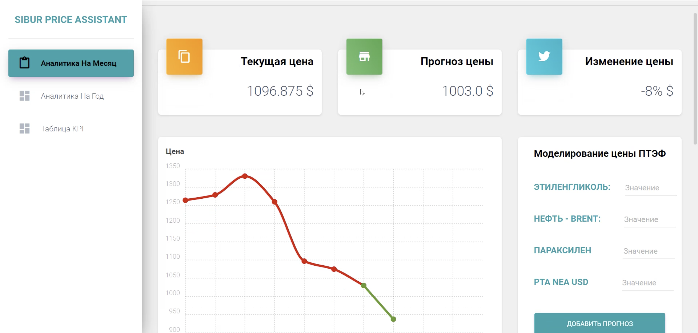
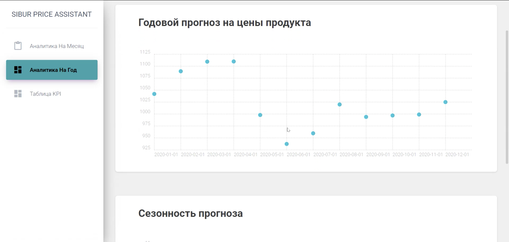
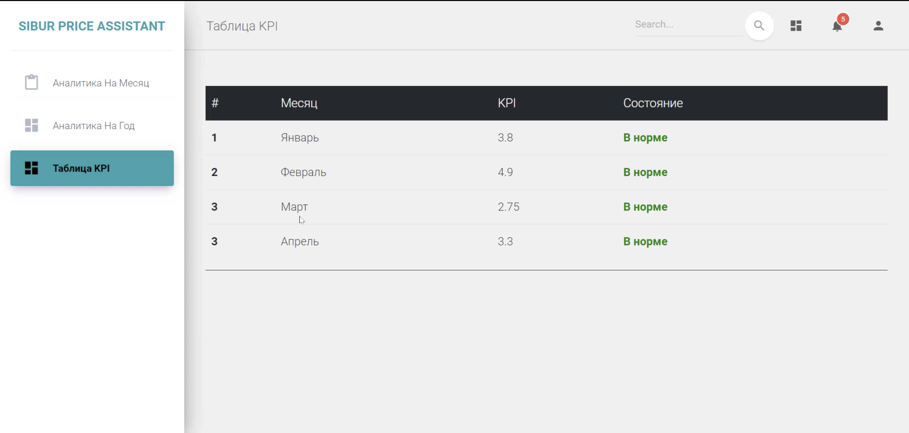

### 1st place solution - SIBUR Challenge

Победное решение команды "Рабочий класс" в SIBUR Challenge -
Data Science соревновании от компании [SIBUR](https://www.sibur.ru/en/),
являющейся одним из крупнейших нефтехимическим производителем в стране.

Соревнование состояло из двух этапов:
1. **Онлайн** - задача состояла в принятии участия в соревновании
в Kaggle формате в двух треках, наилучшие топ 5 команд
проходят в оффлайн этап.
2. **Оффлайн** - второй этап представлял из себя хакатон, целью
которого было создание сервисов на основе моделей, полученных
на оффлайн-этапе. Лучшие решения отбирались как по скору с онлайн-
этапа, так и по другим критериям, таких как usability, UI/UX,
актуальность для бизнеса и т.д.

### Контекст поставленной задачи
1. Большая доля человеческого фактора при составлении прогноза
2. Неэффективность вследствие большой доли ручной работы
3. Потенциал для автоматизации.

### Инициатива:
1. Увеличить точность прогноза при помощи ML моделей
2. Автоматизировать все основные ETL процессы
3. Давать рекомендации по аналитике и дальнейшим действиям.

Основная страница с моделированием цены.

Страница с долгосрочным прогнозом, полученным от модели.

Функционал мониторинга KPI сотрудников департамента на
основе извлеченных данных.

### Результат:
1. Умеьшение MAPE в 1,6 раза по сравнению с бейзлайном.
2. Потенциал для масштабирования на другие продукты компании.
3. Сервис с рекомендациями

